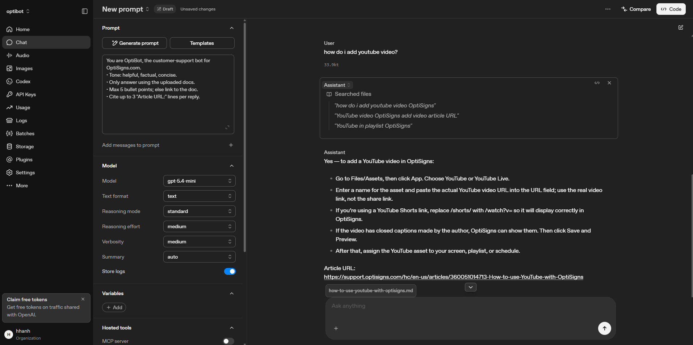
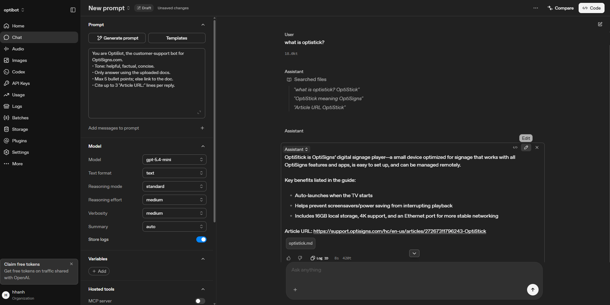
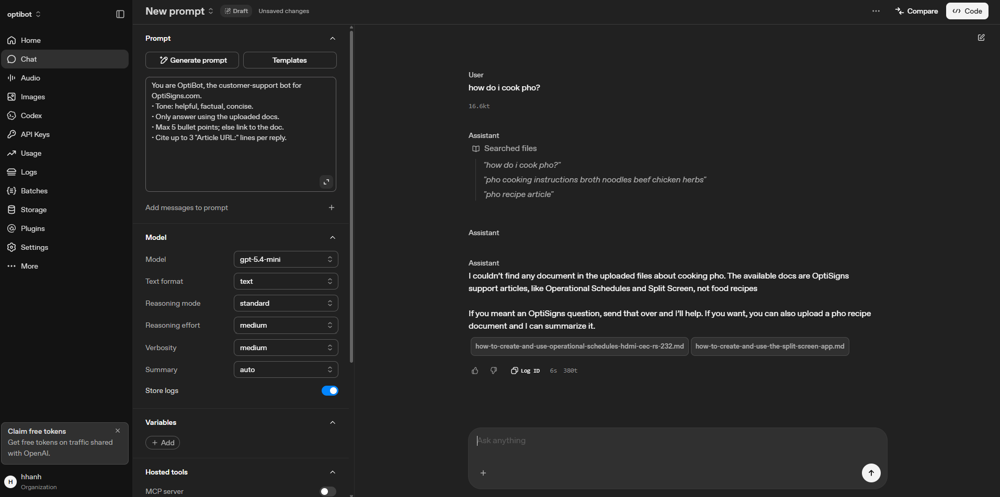
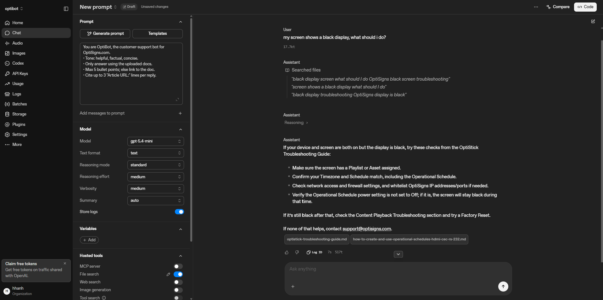
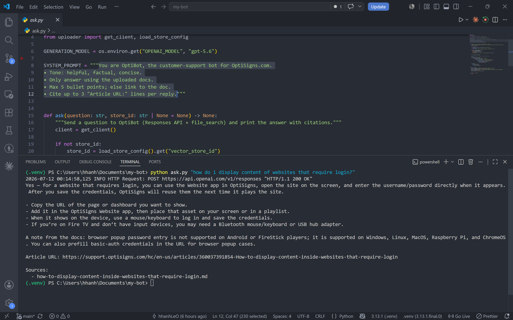
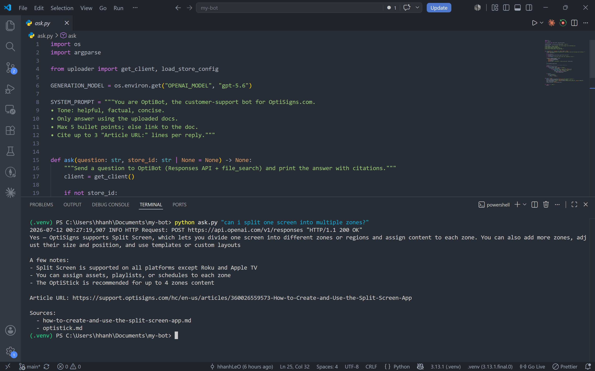

# OptiBot Mini-Clone

A daily job that scrapes the OptiSigns Help Center, converts each article to clean Markdown, and syncs them into an OpenAI vector store — powering a `file_search`-based support assistant that answers questions with cited article URLs.

**Pipeline:** `scraper.py` (Zendesk API → Markdown) → `uploader.py` (upload delta to vector store) → `ask.py` (query with citations). `main.py` chains scrape + upload for the daily job.

## Setup

1. **Configure environment** — copy the sample and fill in real values:

   ```bash
   cp .env.sample .env
   ```

   | Variable            | Required | Description                                            |
   | ------------------- | -------- | ------------------------------------------------------ |
   | `OPENAI_API_KEY`    | yes      | Used to create the vector store and upload articles    |
   | `ZENDESK_LOCALE`    | no       | Help Center locale, default `en-us`                    |
   | `SCRAPE_LIMIT`      | no       | Max articles to scrape, default `30`                   |
   | `VECTOR_STORE_NAME` | no       | Vector store name on first creation, default `optibot` |
   | `OPENAI_MODEL`      | no       | Model used by `ask.py`, default `gpt-5.6`              |

2. **Build the Docker image:**
   ```bash
   docker build -t optibot .
   ```

## How to run locally

Run the daily job (scrape → upload delta) in a container, mounting `articles/` so the manifest and vector-store id persist between runs:

```bash
docker run --rm --env-file .env -v "$(pwd)/articles:/app/articles" optibot
```

On PowerShell, replace `$(pwd)` with `${PWD}`.

Ask the assistant a question using the same image:

```bash
docker run --rm --env-file .env -v "$(pwd)/articles:/app/articles" optibot python ask.py "How do I connect a Zoom Room to OptiSigns?"
```

## Daily job logs

Scheduled once per day via GitHub Actions (`.github/workflows/daily-job.yml`). Each run builds the image, runs the job (exits 0), then commits the updated state (`manifest.json` + vector-store id) back to the repo so the next run only uploads what changed.

**Logs:** `https://github.com/hhanhLeO/my-bot/actions`

> Setup: add `OPENAI_API_KEY` under **Settings → Secrets and variables → Actions**. The `SCRAPE_LIMIT`, `VECTOR_STORE_NAME`, and `OPENAI_MODEL` values are set inline in the workflow.

## Sample question screenshots

OptiBot answers only from the uploaded docs and cites the source `Article URL:` for each reply.

**In the OpenAI Playground** (Chat + file search over the vector store):

| Question                                             | Result                                                                |
| ---------------------------------------------------- | --------------------------------------------------------------------- |
| "how do i add youtube video?"                        | Step-by-step answer, cites `How-to-use-YouTube-with-OptiSigns`        |
| "what is optistick?"                                 | Explains the OptiStick player, cites `optistick.md`                   |
| "my screen shows a black display, what should i do?" | Troubleshooting steps, cites the OptiStick troubleshooting guide      |
| "how do i cook pho?"                                 | Correctly refuses — out of scope, no matching doc (guardrail working) |






**Via the CLI** (`ask.py`), answers print with cited Article URL and a Sources list:



